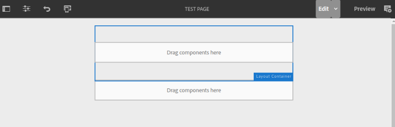
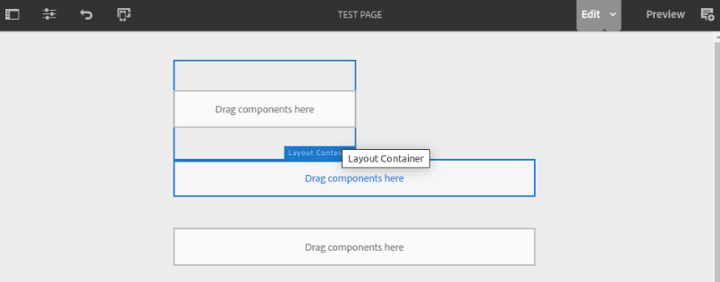
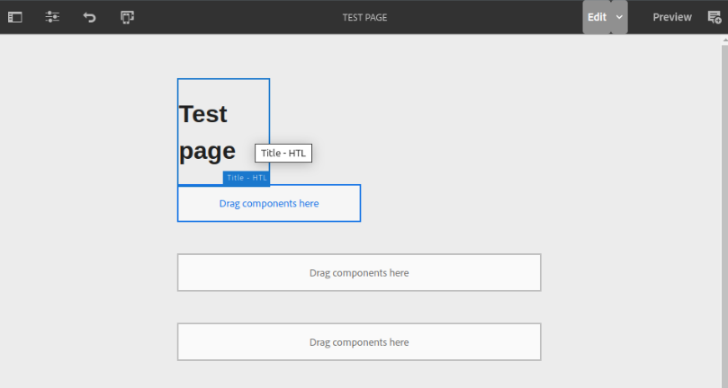

# Responsivity bug with OOTB Layout Container component

## Steps to reproduce

1. Create a new page under `/content/demo/us/en` using the `Test template` template.
2. Add Layout Container (`container1`)  into the root container:

   

3. Add another Layout Container into `container1`

   

4. Add a Title into `container2`:

   

## Result

With each successive level of nesting, the components occupy less and less width.

This seems to be caused by a bug whereby the AEM editor 'loses track' of the responsive width inheritance. Here is a
table of expected vs actual behaviour:

| Container    | cq:responsive | Expected                                | Actual                                                                        |
|--------------|---------------|-----------------------------------------|-------------------------------------------------------------------------------|
| root         | width=6       | 6 of 12 columns                         | 6 of 12 columns                                                               |
| `container1` | none          | 6 of 12 columns (inherited from parent) | 6 of 12 columns (inherited from parent)                                       |
| `container2` | none          | 6 of 12 columns (inherited from parent) | 3 of 12 columns (inheritence is broken, container takes 6 of 6 of 12) instead |

## Workarounds

There are 2 workarounds that authors can use to resolve the issue, but both are very time-consuming and prone to human
error. As a result, this bug has a serious impact on the authoring UX and leads to many visual bugs on the website.

1. Refresh the webpage with F5 after creating each component
2. When placing a Layout Container, use the layout mode to manually resize to full width